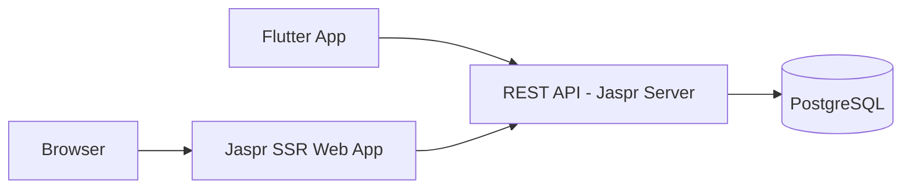
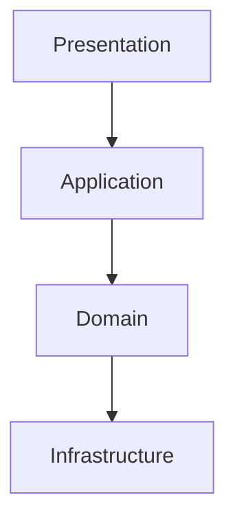

# ENTERPRISE PORTFOLIO SYSTEM

## Full-Stack Dart Architecture Blueprint

### Version 1.0

Author: Flutter Developer Portfolio System  
Stack: Jaspr (SSR) + Jaspr Server + PostgreSQL  
Architecture: Clean Architecture + DDD + Modular Monorepo

======================================================================
TABLE OF CONTENTS
======================================================================

1.  Executive Summary  
2.  Business Objectives  
3.  Non-Functional Requirements  
4.  System Architecture Overview  
5.  Monorepo Strategy  
6.  Domain-Driven Design Structure  
7.  Backend Architecture  
8.  Database Architecture & Indexing Strategy  
9.  API Design & Standards  
10. Authentication & Authorization  
11. Admin Panel Architecture  
12. Frontend Architecture (Jaspr SSR)  
13. State Management Strategy  
14. Design System & UI Architecture  
15. Responsive System Engineering  
16. SEO & SSR Strategy  
17. Content Management System Design  
18. Project Module Deep Dive  
19. Contact System Deep Dive  
20. Error Handling & Observability  
21. Logging & Monitoring  
22. Security Architecture  
23. Performance Optimization  
24. Caching Strategy  
25. CI/CD Pipeline Design  
26. Docker & Containerization  
27. Infrastructure Strategy  
28. Environment Configuration  
29. Testing Strategy  
30. Migration & Versioning Strategy  
31. Scalability Considerations  
32. Multi-language Support Strategy  
33. Future Feature Expansion  
34. DevOps Checklist  
35. Production Readiness Checklist  
36. Maintenance Strategy  
37. Disaster Recovery Plan  
38. Documentation Standards  
39. Coding Standards  
40. Final Architectural Summary  

======================================================================
1. EXECUTIVE SUMMARY
======================================================================

This system is a production-grade full-stack portfolio platform designed to demonstrate enterprise-level engineering capability using the Dart ecosystem.

It showcases:
- SSR web engineering
- Backend API architecture
- Secure admin system
- Database modeling
- DevOps readiness
- Clean Architecture implementation
- Flutter app parity for mobile experience

======================================================================
2. BUSINESS OBJECTIVES
======================================================================

- Showcase projects dynamically
- Enable real-time content updates
- Secure admin editing panel
- Store and manage contact inquiries
- Demonstrate enterprise engineering discipline
- Provide portable Flutter UI architecture for mobile and web

======================================================================
3. NON-FUNCTIONAL REQUIREMENTS
======================================================================

Performance:
- API response time under 200ms (P95)
- Lighthouse score over 90
- Optimized image loading and caching

Security:
- JWT-based authentication
- Encrypted password storage
- Rate limiting
- Security headers

Scalability:
- Horizontal scaling capability
- Stateless backend
- Database indexing strategy

Availability:
- 99.9% uptime target

======================================================================
4. SYSTEM ARCHITECTURE OVERVIEW
======================================================================

Mermaid diagram:


Runtime flow:
Client → SSR Web App → REST API → PostgreSQL  
Flutter App → REST API → PostgreSQL

======================================================================
5. MONOREPO STRATEGY
======================================================================

```
portfolio/
  apps/
    web_app/
    backend/
  packages/
    shared_models/
    core/
    repositories/
```

Benefits:
- Shared DTO models
- Strong typing across layers
- Cleaner CI/CD
- Single source of truth for schemas

======================================================================
6. DOMAIN-DRIVEN DESIGN STRUCTURE
======================================================================

Domains:
- Projects
- Content
- Contact
- Admin

Each domain contains:
- Entity
- Repository contract
- Use cases
- Data source
- API controller

Layer diagram:


======================================================================
7. BACKEND ARCHITECTURE
======================================================================

Layered Architecture:
Presentation → Application → Domain → Infrastructure

Responsibilities:
- Presentation: routing, validation, responses
- Application: orchestration and use cases
- Domain: entities and business rules
- Infrastructure: persistence and external services

Sample use case:
```dart
class ListProjects {
  final ProjectRepository repository;
  ListProjects(this.repository);
  Future<Paginated<Project>> call({
    required int page,
    required int limit,
    bool? featured,
    String? query,
  }) {
    return repository.list(
      page: page,
      limit: limit,
      featured: featured,
      query: query,
    );
  }
}
```

======================================================================
8. DATABASE ARCHITECTURE & INDEXING STRATEGY
======================================================================

Tables:
- projects
- profile_content
- contact_messages
- admin_users

PostgreSQL schema example:
```sql
CREATE TABLE projects (
  id UUID PRIMARY KEY,
  title TEXT NOT NULL,
  description TEXT NOT NULL,
  tech_stack JSONB NOT NULL DEFAULT '[]',
  is_featured BOOLEAN NOT NULL DEFAULT FALSE,
  created_at TIMESTAMPTZ NOT NULL,
  updated_at TIMESTAMPTZ NOT NULL
);

CREATE INDEX idx_projects_featured ON projects(is_featured);
CREATE INDEX idx_projects_title ON projects USING GIN (to_tsvector('english', title));

CREATE TABLE profile_content (
  id UUID PRIMARY KEY,
  section_name TEXT UNIQUE NOT NULL,
  markdown TEXT NOT NULL,
  updated_at TIMESTAMPTZ NOT NULL
);

CREATE INDEX idx_content_section ON profile_content(section_name);
```

======================================================================
9. API DESIGN & STANDARDS
======================================================================

Principles:
- RESTful
- Versioned endpoints
- JSON response envelope
- Proper HTTP status codes

Response format:
```json
{ "status": "success", "message": "Projects loaded", "data": {} }
```

Endpoints:
- GET /api/v1/projects
- GET /api/v1/projects/:id
- POST /api/v1/admin/projects
- PUT /api/v1/admin/projects/:id
- DELETE /api/v1/admin/projects/:id
- GET /api/v1/content/:section
- PUT /api/v1/admin/content/:section
- POST /api/v1/contact
- GET /api/v1/admin/contact
- POST /api/v1/admin/login
- GET /api/v1/admin/me

======================================================================
10. AUTHENTICATION & AUTHORIZATION
======================================================================

Authentication:
- JWT tokens with short-lived access
- bcrypt password hashing
- Admin-only protected routes

Authorization:
- Middleware validates signature, expiry, and role
- Role-based checks with admin scope

JWT example:
```dart
final token = jwt.sign({
  'sub': user.id,
  'email': user.email,
  'role': user.role,
});
```

======================================================================
11. ADMIN PANEL ARCHITECTURE
======================================================================

Modules:
- Login
- Dashboard
- Project CRUD
- Markdown Content Editor
- Contact Messages Viewer

Guard:
- JWT-based route guard
- Redirect unauthenticated users to login

======================================================================
12. FRONTEND ARCHITECTURE (JASPR SSR)
======================================================================

Component hierarchy:
AppLayout → Navbar → Sections → Footer

Feature-based structure:
```
lib/
  features/
    projects/
    content/
    contact/
    admin/
  shared/
    layout/
    ui/
```

======================================================================
13. STATE MANAGEMENT STRATEGY
======================================================================

Flutter App: Riverpod
- projectProvider
- contentProvider
- authProvider
- contactProvider

Jaspr SSR: AppState + InheritedComponent for shared state.

Flutter Riverpod example:
```dart
final apiClientProvider = Provider<ApiClient>((ref) {
  return ApiClient(baseUrl: const String.fromEnvironment('API_BASE_URL'));
});

final projectRepositoryProvider = Provider<ProjectRepository>((ref) {
  return ApiProjectRepository(ref.read(apiClientProvider));
});

final projectProvider = FutureProvider.autoDispose((ref) async {
  final repo = ref.read(projectRepositoryProvider);
  return repo.list(page: 1, limit: 10);
});
```

======================================================================
14. DESIGN SYSTEM & UI ARCHITECTURE
======================================================================

Tokens:
- Color palette with dark-first scheme
- Typography scale using Inter
- Spacing scale: 4, 8, 12, 16, 24, 32, 48

Flutter Theme sample:
```dart
final theme = ThemeData(
  brightness: Brightness.dark,
  fontFamily: 'Inter',
  colorScheme: const ColorScheme.dark(
    primary: Color(0xFF7C4DFF),
    secondary: Color(0xFF00E5FF),
  ),
);
```

======================================================================
15. RESPONSIVE SYSTEM ENGINEERING
======================================================================

Breakpoints:
```dart
enum Breakpoint { mobile, tablet, desktop, wide }
```

Responsive rules:
- Mobile: 0–599
- Tablet: 600–1023
- Desktop: 1024–1439
- Wide: 1440+

Grid:
- 4 columns on mobile
- 8 columns on tablet
- 12 columns on desktop+

======================================================================
16. SEO & SSR STRATEGY
======================================================================

Requirements:
- Server-side rendering enabled
- Meta tags per page
- Sitemap.xml
- robots.txt
- JSON-LD structured data

JSON-LD snippet:
```json
{
  "@context": "https://schema.org",
  "@type": "Person",
  "name": "Portfolio Owner",
  "url": "https://example.com"
}
```

======================================================================
17. CONTENT MANAGEMENT SYSTEM DESIGN
======================================================================

Markdown-based content with:
- Section name as key
- Revision timestamps
- Rendered to HTML at the edge or server

Pipeline:
Admin → Markdown → API → DB → SSR renderer → HTML

======================================================================
18. PROJECT MODULE DEEP DIVE
======================================================================

Features:
- CRUD operations
- Featured flag
- Pagination
- Filtering

Entity example:
```dart
class Project {
  final String id;
  final String title;
  final String description;
  final List<String> techStack;
  final bool isFeatured;
  final DateTime createdAt;
  final DateTime updatedAt;

  Project({
    required this.id,
    required this.title,
    required this.description,
    required this.techStack,
    required this.isFeatured,
    required this.createdAt,
    required this.updatedAt,
  });
}
```

======================================================================
19. CONTACT SYSTEM DEEP DIVE
======================================================================

Flow:
User → Form Validation → API → DB → Email Notification

Validation:
- Name length
- Email format
- Message max length

Rate limiting applied at API gateway and server middleware.

======================================================================
20. ERROR HANDLING & OBSERVABILITY
======================================================================

Standardized error envelope:
```json
{ "status": "error", "message": "Description" }
```

Backend error handling:
- Centralized middleware
- Safe error messages for clients
- Full stack trace to server logs

Flutter error handling:
```dart
class ApiFailure implements Exception {
  final String message;
  ApiFailure(this.message);
}

Future<T> guard<T>(Future<T> Function() run) async {
  try {
    return await run();
  } catch (error) {
    throw ApiFailure(error.toString());
  }
}
```

======================================================================
21. LOGGING & MONITORING
======================================================================

Logging:
- JSON structured logs
- Correlation ID per request
- Log levels: debug, info, warn, error

Monitoring:
- API latency metrics
- Error rate monitoring
- Database connection health

======================================================================
22. SECURITY ARCHITECTURE
======================================================================

Controls:
- JWT authentication with expiry
- bcrypt password hashing
- CORS restrictions
- Security headers
- Rate limiting
- Input validation
- Secrets stored in environment variables

Recommended headers:
- X-Content-Type-Options
- X-Frame-Options
- Referrer-Policy
- Permissions-Policy

======================================================================
23. PERFORMANCE OPTIMIZATION
======================================================================

Backend:
- Indexes for hot queries
- Pagination for list endpoints
- In-memory caching for short-lived data

Frontend:
- Lazy loading sections
- Image compression
- SSR caching for stable pages

Flutter:
- Avoid unnecessary rebuilds
- Use const widgets
- Split heavy widgets into isolated subtrees

======================================================================
24. CACHING STRATEGY
======================================================================

Layers:
- CDN for static assets
- In-memory cache for API responses
- DB query caching for read-heavy endpoints

Invalidation:
- Cache busting on content update
- TTL for public endpoints

======================================================================
25. CI/CD PIPELINE DESIGN
======================================================================

Stages:
- Install dependencies
- Lint and analyze
- Run unit tests
- Build release artifacts
- Deploy to staging
- Promote to production

Artifacts:
- Backend executable
- Web SSR executable
- Docker images

======================================================================
26. DOCKER & CONTAINERIZATION
======================================================================

Backend:
- Multi-stage build for smaller images
- Exposes 8080

Web App:
- SSR binary with API_BASE_URL
- Exposes 8081

Compose:
- Backend + Web + PostgreSQL

======================================================================
27. INFRASTRUCTURE STRATEGY
======================================================================

Recommended stack:
- Managed PostgreSQL
- Container runtime
- CDN for static assets
- Secrets manager

Network layout:
Public Web → SSR Container → API Container → DB

======================================================================
28. ENVIRONMENT CONFIGURATION
======================================================================

Backend:
- PORT
- JWT_SECRET
- DB_HOST
- DB_PORT
- DB_NAME
- DB_USER
- DB_PASSWORD
- RATE_LIMIT_MAX
- RATE_LIMIT_WINDOW

Web App:
- PORT
- API_BASE_URL

Flutter App:
- API_BASE_URL

======================================================================
29. TESTING STRATEGY
======================================================================

Backend:
- Unit tests for repositories and use cases
- Integration tests against PostgreSQL

Flutter:
- Unit tests for services
- Widget tests for UI
- Integration tests for full app flow

Sample Flutter widget test:
```dart
testWidgets('renders project title', (tester) async {
  await tester.pumpWidget(
    const MaterialApp(
      home: Scaffold(body: Text('Project X')),
    ),
  );
  expect(find.text('Project X'), findsOneWidget);
});
```

======================================================================
30. MIGRATION & VERSIONING STRATEGY
======================================================================

Database migrations:
- Versioned SQL scripts
- One-way migrations with rollback plan

Versioning:
- Semantic versioning for API
- Deprecation schedule for breaking changes

======================================================================
31. SCALABILITY CONSIDERATIONS
======================================================================

- Stateless services
- Horizontal scaling behind load balancer
- DB read replicas for heavy reads
- Cache layers for static responses

======================================================================
32. MULTI-LANGUAGE SUPPORT STRATEGY
======================================================================

Flutter:
- ARB-based localization
- Locale detection and overrides

SSR:
- Language routing
- Content per locale in CMS

======================================================================
33. FUTURE FEATURE EXPANSION
======================================================================

- Multi-admin roles
- Analytics dashboard
- Automated build pipelines
- Project tagging and search
- GraphQL gateway

======================================================================
34. DEVOPS CHECKLIST
======================================================================

- CI passes on pull requests
- Secrets stored securely
- Monitoring and alerts configured
- Database backups scheduled
- Logs centralized

======================================================================
35. PRODUCTION READINESS CHECKLIST
======================================================================

- Security scan completed
- Load test baseline
- Error budgets defined
- On-call rotation
- Documentation updated

======================================================================
36. MAINTENANCE STRATEGY
======================================================================

- Monthly dependency updates
- Quarterly architecture review
- Audit logs for admin actions
- Regular backups verified

======================================================================
37. DISASTER RECOVERY PLAN
======================================================================

- Daily DB backups
- RTO: 4 hours
- RPO: 1 hour
- Runbook for recovery

======================================================================
38. DOCUMENTATION STANDARDS
======================================================================

- Architecture decision records
- API docs with examples
- Onboarding guide for contributors

======================================================================
39. CODING STANDARDS
======================================================================

- Dart lints enforced
- Layer boundaries respected
- Dependency injection for testability
- Error handling uses typed failures

======================================================================
40. FINAL ARCHITECTURAL SUMMARY
======================================================================

This enterprise-level portfolio system demonstrates:
- Full-stack Dart mastery
- Clean Architecture discipline
- Secure backend engineering
- DevOps readiness
- SSR web capability
- Scalable design thinking

It positions the developer as a full-stack Dart engineer with production-ready Flutter and web architecture skills.
